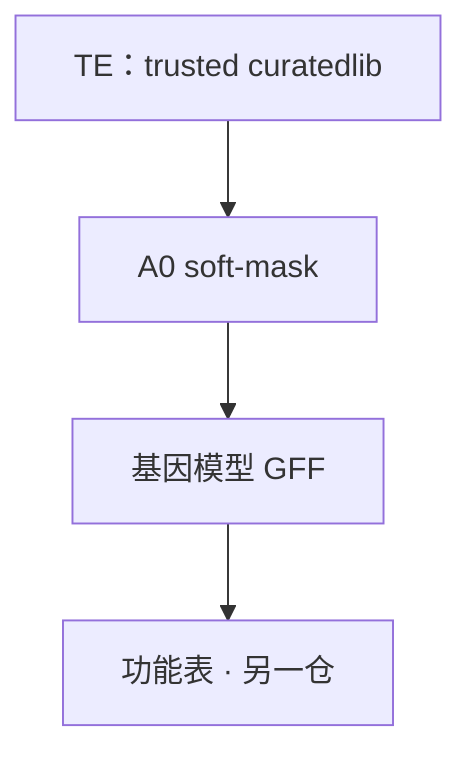

# TE 与基因结构注释的关系

## 核心关系（一句）

**TE 注释是地板；基因结构注释是墙体。**  
地板没铺好，墙会歪——但地板本身不是楼。

## 为什么基因预测前要管 TE？

预测器（**BRAKER3/4**、GALBA、Helixer…）会在「看起来像基因」的地方下刀。  
TE 里常有类似 ORF 的片段 → 假基因爆炸。  
真基因（抗病串联等）又常挨着重复区 → **不能**删成 `N`（hard-mask）。

因此：

1. **soft-mask**（`-xsmall`）：重复区小写，碱基还在。  
2. 库必须是 **trusted**，不是生 EDTA、不是整份 working、不是 `cat`+CD-HIT。

实验室四层产品与漏斗（含图）：  
→ **[18_TE流程课_借鉴实验室03_TE.md](18_TE流程课_借鉴实验室03_TE.md)**

英文纪律：[`../TE_LIBRARY.md`](../TE_LIBRARY.md)

## 三仓分工

| 问题 | 哪里 |
|------|------|
| TE 家族、门控、panEDTA | 实验室 `03_TE` / [vitis-te](https://github.com/Xuzhen-Li/vitis-te) |
| 基因外显子在哪 | **本仓** gene-structure |
| 蛋白 GO/结构域 | gene-function |

## 为什么（短）

1. 结构引擎默认「看见 ORF 就建基因」——重复区假阳性极高。  
2. hard-mask 用删除解决问题，代价是真基因。  
3. 未门控库当 curatedlib = 把噪音写成真理。  

**反例：** 生 EDTA 硬 mask 后 BRAKER，再夸 BUSCO——楼歪了还在刷漆。

下一页：[03_怎么开始跑.md](03_怎么开始跑.md) · 深课：[18](18_TE流程课_借鉴实验室03_TE.md)
