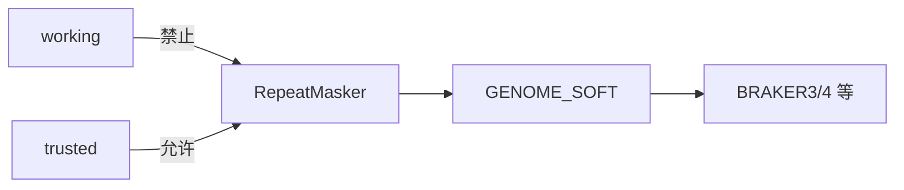

# Soft-mask 与 A0（地板怎么铺）

## A0 前 30 秒

- [ ] 近缘借库 *或* 自建 trusted curatedlib（非 working / 生 EDTA）
- [ ] 真 `sha256sum` → METHODS（禁止 `YOUR_SHA256`）
- [ ] Soft-mask Done when 勾完再 A0 `RUN=1`（见文末 · [TRUSTED_TE_PATH](TRUSTED_TE_PATH.md)）


英文细则：[`../TE_LIBRARY.md`](../TE_LIBRARY.md) · checklist [`../TRUSTED_TE_PATH.md`](../TRUSTED_TE_PATH.md) · [`../../pipeline/A0_softmask.md`](../../pipeline/A0_softmask.md)


## 图：A0 只吃 trusted



完整漏斗与红线：[18_TE流程课_借鉴实验室03_TE.md](18_TE流程课_借鉴实验室03_TE.md)

## 为什么

1. Soft-mask **保留碱基**，预测器仍可跨真基因；hard-mask 会毁序列。  
2. `--curatedlib` 把库抬成高信任。脏库会把真基因当成 TE。结果是降权/漏检，或假 TE 膨胀（碱基仍是小写，不是改成 N）。  
3. Working / 生 EDTA / `cat`+CD-HIT **都不是** trusted。  
4. A0b（ProtExcluder）**可选**；实验室门控本体是 CDS+emit trusted，不是 A0b。  
5. A0 产出的 `GENOME_SOFT` 是所有草稿支的共同地板。

**反例：** 把 hard-mask 基因组当 soft 喂 BRAKER（G2 自动不合格）。  

深课：[16_为什么TE要trusted.md](16_为什么TE要trusted.md)

## Soft vs hard mask

| 方式 | 重复区变成什么 | 对基因预测的影响 |
|------|----------------|------------------|
| **Soft-mask**（`-xsmall`） | **小写字母**，碱基还在 | 预测器会降权重复区，但仍能跨过真基因 |
| **Hard-mask** | 改成 `N` | 序列没了；嵌在重复里的真基因（如 NLR）易被毁掉 |

本 playbook：**BRAKER / GALBA 一类 ab initio 只用 soft-mask**。把 hard-mask 基因组当 soft 喂进去，算自动不合格（见 [`../EVALUATION.md`](../EVALUATION.md) G2）。

## Trusted vs working（四层产品，别揉成一份 FASTA）

实验室 TE 流水线产出四类东西（葡萄例子见英文 TE_LIBRARY）：

| 产品 | 能否当 soft-mask / `--curatedlib` |
|------|----------------------------------|
| Working lib（TEtrimmer + CD-HIT） | **否**（整份） |
| Family catalog | 否（目录用） |
| **Trusted curatedlib** | **是** — 唯一金标准 |
| panEDTA combine | 泛基因组 TE 轨道；**不是** `cat` 替代 |

口诀：

> **Dedup ≠ curation。**  
> `cat` 多个 haplotype 的 TElib 再 CD-HIT，**不等于** trusted curatedlib。

生 EDTA 粗库、整份 working 库、或把 NLR/CDS 塞进 curatedlib，都会出问题。  
宿主基因会被「信任」成 TE。  
soft-mask 后预测器**降权/漏报**真基因，或假基因爆炸（碱基仍是小写，**不是** hard-mask 改成 N）。

## A0 / A0b 在干什么

```text
trusted curatedlib
        │
        ├─（可选）A0b ProtExcluder：再扫一遍宿主蛋白污染
        │
        ▼
RepeatMasker -lib trusted -xsmall
        │
        ▼
GENOME_SOFT  →  交给 S11/S1/S2…
```

- **A0**：用 **trusted** 库 soft-mask，产出 `GENOME_SOFT`。  
- **A0b**：**可选**再扫；有完整 CDS-gated trusted + sha256 时可跳过，METHODS 写清。  
- 验证：soft-mask 比例别是 0% 或离谱全灭（见 pipeline 笔记）。

## 基因结构仓要记什么

| 产物 | 用途 |
|------|------|
| `GENOME_SOFT` | 预测器输入 |
| Trusted lib 路径 + 版本 / sha256 | METHODS |
| 「working ≠ curatedlib」一句 | METHODS |
| A0b exclusion（若跑了） | METHODS / S10 |

基因数爆炸、怀疑 TE 污染 → 叠加 **S10**（回炉 remask，再进同一草稿支）。


## Soft-mask Done when（进 A0 / `RUN=1` 前）

与英文 Wiki [Soft-mask — Done when](https://github.com/Xuzhen-Li/gene-structure-annotation/wiki/Soft-mask-TE#soft-mask--done-when-before-a0--run1) 对齐；勾选用英文清单 [`../TRUSTED_TE_PATH.md`](../TRUSTED_TE_PATH.md)：

- [ ] curatedlib 路径 + 版本 + **真 sha256**（近缘借库须写清来源；禁止 `YOUR_SHA256` / 空校验）
- [ ] 确认不是 working / 生 EDTA / `cat`+CD-HIT 冒充
- [ ] 口头：soft ≠ hard，且 `softmasked_fraction` ≠ 基因组 TE%
- [ ] METHODS 已预留 trusted TE 行

任一未勾 → **禁止 A0** / 禁止 `RUN=1` RepeatMasker。中文指针：[TRUSTED_TE_PATH.md](TRUSTED_TE_PATH.md)。

## 课上口头检查（交 A0 前）

能用一句话说清：**soft ≠ hard**，且 **`softmasked_fraction` ≠ 基因组 TE%**。说不清就先别跑 mask。

## softmasked_fraction ≠ 基因组 TE%

`softmasked_fraction`（小写碱基占比）**不是**「基因组 TE 含量」论文数字。  
为刷高这个比例去用 working / 生 EDTA 当 mask 库 = 踩红线。真正 TE% 来自 trusted 库注释与实验室约定产品，见 FAQ / TE_LIBRARY。

下一页：[06_质控课.md](06_质控课.md)
