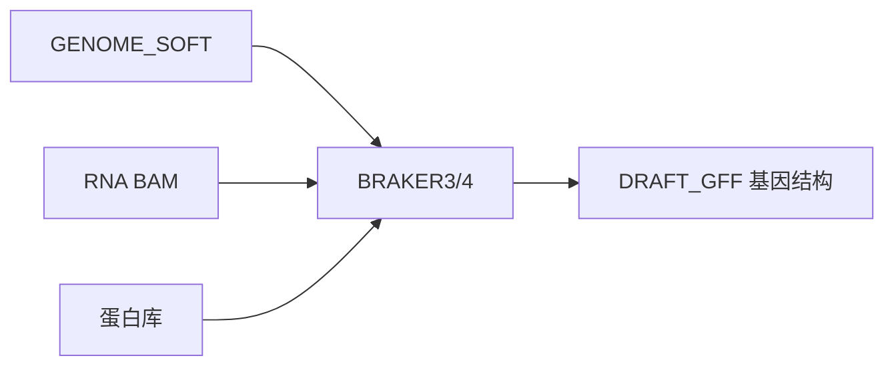

# S1 精讲：BRAKER 路线（默认草稿）

何时选：有 **Illumina RNA + 蛋白证据**，没有近缘已整理参考 GFF。  
英文流程：[`../QUICKSTART.md`](../QUICKSTART.md) · [`../SCENARIOS.md`](../SCENARIOS.md) · [`../STAGE_IO.md`](../STAGE_IO.md)

## 为什么

1. 无近缘好参考时，**RNA+蛋白**是最强常用证据组合（Freedman 基准）。  
2. BRAKER 把剪接与蛋白同源收进可训模型，适合当**默认草稿**。  
3. **StringTie 对照**捕捉 isoform/UTR 线索，误差模式与 ab initio 互补。  
4. 对照 ≠ 偷换 — 终稿合并权重必须可写进 METHODS。  
5. 蛋白必须从**本轮** GFF 重抽，否则 QC 评幽灵。

**反例：** 有 RNA 却只用 Helixer，并在 METHODS 写成 S1。  

深课：[14_为什么这样选证据.md](14_为什么这样选证据.md)


## 小问答：为何结构仓里会出现 BRAKER3？

**因为 BRAKER 就是「结构注释」默认引擎之一**，不是功能注释软件。

| 问题 | 答案 |
|------|------|
| BRAKER 产出什么？ | **基因坐标 GFF**（外显子/CDS），供后面抽蛋白 |
| 为何常写 BRAKER3？ | 论文与 [Galaxy 教程](../TUTORIALS_AND_MEETINGS.md) 仍大量用 **BRAKER3**；本仓默认 **BRAKER4（或 BRAKER3）** |
| 和 TE 什么关系？ | TE → **trusted soft-mask** → 再跑 BRAKER；BRAKER **不**做 TE 家族库 |
| 和 GO/KEGG？ | 无关。GO 在功能仓 F1 |



## 这条线在干什么

用 RNA 的剪接证据 + 蛋白同源，让 GeneMark/Augustus（经 BRAKER3/4）学出基因模型；再用 **StringTie→TransDecoder** 当对照轨，而不是偷偷换掉 BRAKER。

```text
Asm* → A0 soft-mask
     → A1b RNA → BAM
     → A2  BRAKER  → DRAFT_GFF
     → A2b/c 第二套（可选）+ StringTie 对照
     → A4 合并 → A5 AGAT → A3 蛋白
     → 01 BUSCO+PSAURON → 02 优先表 → 04 GSAman → 06 放行
```

## 逐步（教学版）

1. **Asm1** — 基因组 BUSCO + N50 + 倍性写清楚；`ASSEMBLY_OK=yes` 再往下。
2. **A0** — Trusted curatedlib soft-mask → `GENOME_SOFT`（见 [05](05_softmask与A0.md)）。
3. **A1b** — HISAT2/STAR → `RNA_BAM` + index。看比对率；以后浏览器抽查 junction。
4. **A2 主草稿** — `bash pipeline/A2_run_draft.sh` 默认 **print-first**（只打印 `braker.pl`，不替你跑）。在集群上 `RUN=1` 或粘贴该行。产出写入 `DRAFT_GFF`。立刻跑 `A5_agat_stats.sh`：gene/mRNA/CDS 须非零。
5. **对照轨（有 RNA 就做）** — StringTie → TransDecoder：有转录证据时不要只信 ab initio。对照轨找冲突、补 isoform/UTR 线索，**不是**无脑覆盖 BRAKER。
6. **A4 合并** — 两套以上草稿 → EVM/TSEBRA 等；记权重路径进 METHODS。AGAT 计数应落在较好父本附近。
7. **A3 → 01 → 02 → 04 → 06** — 从**本轮** GFF 重抽蛋白；蛋白 BUSCO 写清谱系；PSAURON → 优先表；GSAman；打 `RELEASE_TAG`。

## METHODS 里至少要有

- 草稿 ID：`S1`
- BRAKER 主次版本；蛋白库（如 OrthoDB clade）；RNA 样本简述
- Soft-mask 用的 trusted lib 版本
- StringTie 是否做了对照
- 合并器与权重（若合并）

## 常见翻车（S1 特有）

| 现象 | 先查 |
|------|------|
| 重复区基因爆炸 | Hard-mask？Working lib 当 curatedlib？→ A0/S10 |
| 蛋白空文件 | GFF 无 CDS；gffread 基因组路径错 |
| BUSCO 极低 | 谱系错；组装碎；草稿根本没训起来 |
| 「我跑了 Helixer 就算 S1」 | 否 — 那是 S13 对照支 |

默认拿不准且有 RNA+蛋白 → **就是 S1**。近缘有好参考 → 先看 [08_S11](08_S11精讲_liftover优先.md)。

下一页：[08_S11精讲_liftover优先.md](08_S11精讲_liftover优先.md)
