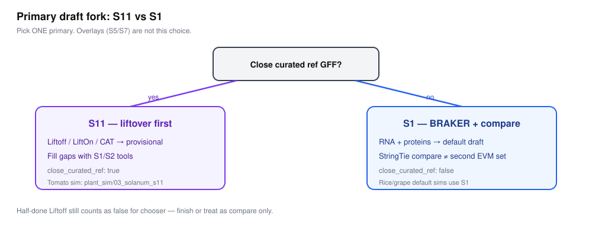

# S11 精讲：Liftover 优先

何时选：有**近缘、已整理**的参考基因组 + 参考 GFF。  
英文：[`../ROADMAP.md`](../ROADMAP.md) · STAGE_IO「Liftover-first」表。

## 为什么

1. 近缘已整理模型是**高价值证据**，应先用而不是先丢（Ji 2026）。  
2. Liftover 通常更快，并能反映拷贝数变化带来的额外拷贝。  
3. 投影完仍是 **provisional** — 必须补洞 + 主干 QC。  
4. 参考过远硬 lift 会系统性变差 → 改 S1/S2。  
5. METHODS 必须区分 lift 与 de novo 基因座。

**反例：** Lift 完直接标 L1，空洞未补、蛋白 BUSCO 未跑。

## S11 vs S11-lite

| | **S11**（完整） | **S11-lite** |
|--|--|--|
| 做什么 | liftover **+ 补洞** + 主干 QC | **只** lift，不补洞 |
| METHODS | `primary=S11`；可达 `grade=L1` + `status=qualified` | `primary=S11-lite`；`grade=L0` + `status=provisional` |
| 口播 | 「先 lift 再补洞」 | 「快搬 / lift-only」——**不要**叫完整 S11 |
  

深课：[14_为什么这样选证据.md](14_为什么这样选证据.md)



## 为什么优先搬坐标，而不是先 invent

Ji *Nat Rev Genet* 2026：证据决定方法。近缘参考已经人工/社区打磨过的模型，**先投影再补洞**，通常比从零 BRAKER 更快、更稳——前提是参考真的「近」且 GFF 可信。

```text
REF_FA + REF_GFF + 目标基因组
        │
        ▼
Liftoff / LiftOn / CAT（± TOGA2 若有全基因组比对）
        │
        ▼
Lifted GFF（先标 status=provisional）
        │
        ▼
空洞 / 未映射区 → 用 S1 或 S2 补
        │
        ▼
合并 → 主干质控（同 S1 后半）
```

## 教学要点

1. **S11 是草稿支，不是「已经合格」。** 投影完只算 L0，直到补洞 + AGAT + 蛋白 BUSCO + 分诊过关。
2. **写清「哪些是 lift、哪些是 de novo」。** METHODS 读者要能复现哪些基因座来自参考、哪些是本地发明。
3. **参考远了不要硬 lift。** 科级距离过大时 liftover 会系统性变差；改走 S1/S2。
4. **CAT / LiftOn / Liftoff** 目标都是「坐标搬家 + 保留基因结构语义」，输出仍要 gffread/AGAT 验。

## 和 S1 的关系

| | S11 | S1 |
|--|-----|-----|
| 主证据 | 近缘参考 GFF | RNA + 蛋白 |
| 典型顺序 | Lift → 补洞 | 直接预测 |
| 可叠加 | 补洞时跑 S1/S2 | 有参考时仍可事后对照 lift |

有完美近缘参考时：**先 S11，再补**；不要为了「显得更原创」跳过 liftover。

补洞操作（英文助手）：[`../../pipeline/A2e_s11_gapfill.md`](../../pipeline/A2e_s11_gapfill.md) · 中文指针 [`A2e_s11_gapfill.md`](A2e_s11_gapfill.md)。

下一页：[09_S2_S3_S13_S14速览.md](09_S2_S3_S13_S14速览.md)

> 英文 Wiki 验收句：[S11 gap-fill — Done when](https://github.com/Xuzhen-Li/gene-structure-annotation/wiki/Choose-branch#s11-gap-fill--done-when)（lift-only 必须标 S11-lite）。
