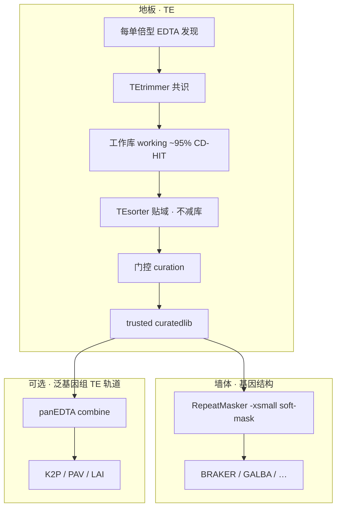
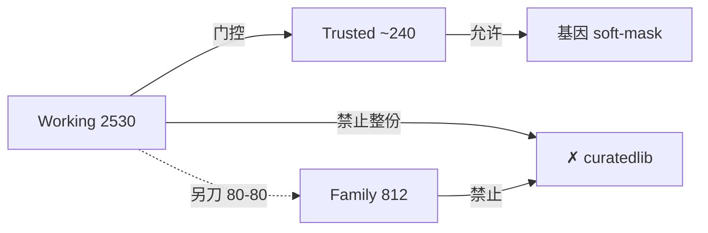
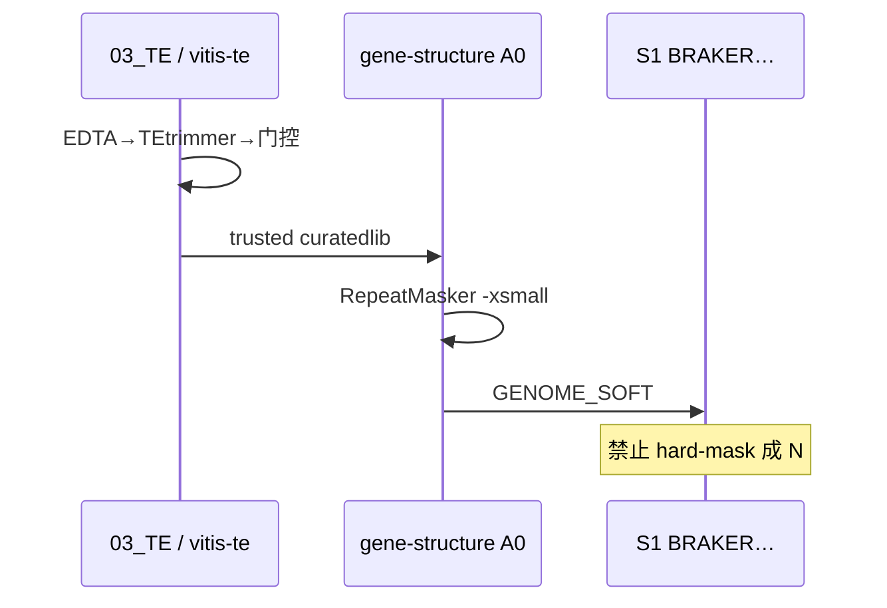

# TE 流程课（借鉴实验室 pangenome `03_TE`）

> 公开教学版。数字来自葡萄面板 **R1 档案漏斗**（示例，不是宇宙常数）。  
> 私有集群路径、作业号、未冻结草稿 **不写进本仓**。  
> 英文操作纪律：[`../TE_LIBRARY.md`](../TE_LIBRARY.md) ·  stub：[vitis-te](https://github.com/Xuzhen-Li/vitis-te)

---

## 先建立地图



**一句话：** TE 流程做出 **trusted**；基因结构仓只用它做 **soft-mask**。  
基因 GFF 合格 ≠ TE 注释做完；LAI/K2P 要等名字对齐的 pan TE GFF。

---

## 四层产品（不要压成一个 FASTA）

实验室笔记强调：下面四样东西 **不是同一种货**。

| 产品 | 葡萄 R1 示例量级 | 能不能整份当 `--curatedlib` / 基因 soft-mask 金标准？ |
|------|------------------|------------------------------------------------------|
| **Working 工作库** | `…_cdhit95.fa` ≈ **2530** | **否**（敏感共识集；含 Unknown / 未门控） |
| **Family 家族目录** | 80-80 ≈ **812** | **否**（目录用；勿覆盖 working） |
| **Trusted curatedlib** | R1 档案示例 ≈ **240**（v1.0） | **是** ← 基因 A0 只认 trusted；面板金库以现行 emit 为准 |
| **panEDTA combine** | pan 库 | 官方 combine；**不是** `cat` 各基因组 TElib |



### 为什么要分四层？

- **发现粗、共识多、可信少** — 漏斗是正常的，不是失败。  
- 基因组 **TE%** 看 **注释 GFF**，不看库里有几条 consensus。  
- TEsorter 的 `all.cls.lib` / 域表 = 给一部分序列 **贴标签**；**不能**拿去替换 working FASTA。

**反例：** `cat` 106 份 haplotype TElib → CD-HIT → 当 curatedlib（笔记 §3.9.5：dedup ≠ curation；策略 A 已废弃）。

---

## 数字漏斗（教学用 · 葡萄 R1）

> 只帮你建立数量级直觉。你的物种会不同。

```text
每 hap EDTA TElib     ~2k–5k 条
        ↓ 若 cat 全 panel（不要学）
     ~十万级叠草稿
        ↓ 按 hap 跑 TEtrimmer（多数拷贝不够会 skip）
     Perfect+Good 再并库
        ↓ CD-HIT ~95%
     Working ≈ 2530     ← 停在「工作库」
        ↓ 可选 80-80
     Family ≈ 812
        ↓ TEsorter（例：247/2530 有域）
     域标签贴上；2530 条仍都在
        ↓ CDS（如 PN40024.v4.1 冻结）+ TEsorter 命名超家族过滤 + emit 规则
     Trusted ≈ 240（R1 v1.0 档案）← 才能进基因 soft-mask
        （不是「人工逐条点满 240」；Helitron/TIR motif、LINE-unknown 政策以 emit 规则为准）
```

**第二段不减库：** TEsorter 通过 HMM/BLAST 的只是少数；其余仍留在 working fasta 里，只是没域注解。

---

## R1 教学漏斗 vs R2 现行（状态感）

| | R1 档案（教学常用数字） | R2 现行（笔记 2026-09） |
|-|---------------------------|-------------------------|
| Working | ≈2530（cd-hit95） | 草稿 ≈39909（另开；勿覆盖 v0） |
| check 档 | 已并入故事 | ≈64906（不抽进 working） |
| Trusted | v1.0 ≈240 档案 | **等** TEsorter/门控 → **v1.1**；此前 v1.0 不当默认真金库 |
| 06 试点 / panEDTA | 概念上在 trusted 之后 | 等 v1.1 |

## 和基因结构仓怎么接（A0）



1. 用 **现行 trusted**（记文件名 + 版本 + sha256）。葡萄面板：R1 v1.0≈240 是**档案/教学示例**；笔记侧 R2→**v1.1** 完成前，不要默认 v1.0 已是永久金库——若暂用须在 METHODS 写明。  
2. Soft-mask：`RepeatMasker -lib trusted -xsmall`（A0b/ProtExcluder 仅可选附加，不是实验室门控本体）。  
3. EDTA v2 / pan 注释：**新目录**；禁止 `--overwrite` 冻结发现树。  
4. **非 TE 轨道**（TRF / 端粒 / rDNA…）**永不**进 curatedlib。  
5. CDS 门控参考版本要冻结（葡萄示例 PN40024.v4.1）；换版本 = 重开门控。

实验室 EDTA 发现默认印象（METHODS 要写清）：  
`--species others --sensitive 1 --anno 1`；葡萄第一轮常 **无 `--cds`**；μ 如 `5.4e-9` 需文献/笔记依据；序列名 ≤13 字符并保留 `id_map.tsv`。  
CDS 门控冻结示例：笔记用 **PN40024.v4.1**（换版本 = 重开门控，不是悄悄换）。

---

## 红线墙（贴在屏幕前）

| 不要 | 为什么 |
|------|--------|
| 整份 working → `--curatedlib` | Unknown/基因碎片被 100% 信任 |
| `all.cls.lib` 替换 working | 分类器输出 ≠ 库 |
| hard-mask 给 BRAKER | 真基因（如 NLR）易被毁 |
| 生 EDTA / LAI 当交货 | 未 curated；LAI 要 pan GFF 后 |
| 非 TE 进 curatedlib | nonsense repeats |
| `--overwrite` 冻结 EDTA 发现树 | 毁掉 provenance |
| 换 CDS 版本却沿用旧 trusted | 门控失效 |

---

## 和 BRAKER 的关系（常被问）

**BRAKER3/4 是基因结构引擎**，吃的是 soft-masked 基因组 + RNA/蛋白证据，产出 **gene GFF**。  
TE 流程 **不替代** BRAKER；它只提供 **trusted → soft-mask**，让 BRAKER 少把 TE 当基因、又别 hard-mask 掉真基因。

Galaxy 教程里的 BRAKER3 = 同一条 **S1 结构** 路的上手课，不是功能注释（GO/KEGG）。本仓默认写 **BRAKER4（或 BRAKER3）**，因为社区教程与论文仍大量出现 BRAKER3。

---

## 延伸阅读

| 文档 | 内容 |
|------|------|
| [02_TE与基因的关系.md](02_TE与基因的关系.md) | 地板 vs 墙体 |
| [05_softmask与A0.md](05_softmask与A0.md) | A0 操作直觉 |
| [16_为什么TE要trusted.md](16_为什么TE要trusted.md) | WHY |
| [`../TE_LIBRARY.md`](../TE_LIBRARY.md) | 英文纪律全文 |
| [`../TUTORIALS_AND_MEETINGS.md`](../TUTORIALS_AND_MEETINGS.md) | Galaxy RepeatMasker 等 |

本地权威笔记：**不进 git**。METHODS 只写工具链 + trusted 文件名 + 版本/sha256，不要写桌面/集群绝对路径。
