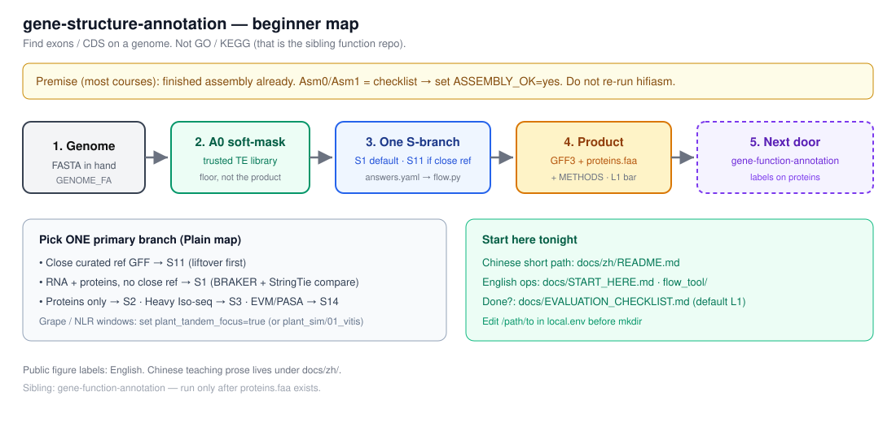
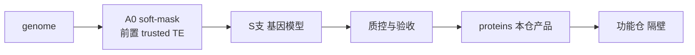

# 中文教学入口 — 基因**结构**注释

> 中文讲清「是什么、为什么、怎么选路、怎么验收」。  
> **跑命令、写 METHODS、装工具**用英文文档（国际可引用）。

[English bilingual policy](../BILINGUAL.md) · [仓库首页](../../README.md)

读图：本仓主线是 **genome → A0 → 基因 GFF → 蛋白**；TE trusted 只是**前置地板**；功能在隔壁。

英文 Start here：[`../START_HERE.md`](../START_HERE.md)

---

## 今天最短路径（先做这个）

| 步 | 打开 | 做什么 |
|----|------|--------|
| 1 | [01_什么是结构注释.md](01_什么是结构注释.md) | 搞清：本仓找外显子，不是做 GO |
| 2 | [03_怎么开始跑.md](03_怎么开始跑.md) | 复制 `answers` → 跑 `flow.py` → 得到 `my_plan.md` |
| 3 | 按 plan 填 [`../../config/example.env`](../../config/example.env) → 集群执行 | 默认常见情况走 **S1**；有近缘好 GFF 走 **S11** |
| 4 | [**验收勾选表**](验收勾选表.md)（或英文 [`../EVALUATION_CHECKLIST.md`](../EVALUATION_CHECKLIST.md)） | 勾完才知道 **行不行**；默认目标 **L1** |

卡住再查：[04_分支怎么选](04_分支怎么选.md) · [13_常见翻车](13_常见翻车.md) · [99_术语表](99_术语表.md) · **[FAQ_入门.md](FAQ_入门.md)**（trusted / answers / 验收常见问）

完整课表 **02/04/05… 第一天不必通读**——最短路径卡了再点开对应课即可。

**TE 只要一件事：** soft-mask 用 **trusted** 库文件（文件名 + 版本/sha256）。  
soft-mask = 重复区**小写**（碱基还在），**不是**改成 N；没有 trusted 就问实验室要，**不要**用生 EDTA 去 mask（抗病基因怕 hard-mask/假库）。深漏斗见 [18](18_TE流程课_借鉴实验室03_TE.md)；Galaxy 指针见 [17](17_外部教程与会议.md)。

EDTA 安装/命令页（文件名是 edta）：[`../tools/edta.md`](../tools/edta.md) · 总表 [`../TOOLS.md`](../TOOLS.md)。

验收命令打印：`python3 pipeline/print_qc_commands.py`（需先 `source config/local.env`）。

**英文操作入口：** [`../../pipeline/flow_tool/`](../../pipeline/flow_tool/) · [`../EVALUATION.md`](../EVALUATION.md) · [`../STAGE_IO.md`](../STAGE_IO.md)

---

## 完整课程（想系统学再按序）

| 顺序 | 文档 | 你学到什么 |
|------|------|------------|
| 0 | [00_为什么要做结构注释.md](00_为什么要做结构注释.md) | **WHY**：结构作为一层；跳过的代价 |
| 1 | [01_什么是结构注释.md](01_什么是结构注释.md) | 结构 ≠ TE ≠ 功能；GFF 里有什么 |
| 2 | [02_TE与基因的关系.md](02_TE与基因的关系.md) | 为什么要 soft-mask；trusted lib |
| 3 | [03_怎么开始跑.md](03_怎么开始跑.md) | 三步上手 + flow 工具 |
| 4 | [04_分支怎么选.md](04_分支怎么选.md) | S11/S1/S2… 对照表 |
| 5 | [05_softmask与A0.md](05_softmask与A0.md) | soft vs hard；trusted vs working |
| 6 | [06_质控课.md](06_质控课.md) | BUSCO/PSAURON/OMArk/AGAT |
| 7 | [07_S1精讲_BRAKER路线.md](07_S1精讲_BRAKER路线.md) | 默认草稿支 |
| 8 | [08_S11精讲_liftover优先.md](08_S11精讲_liftover优先.md) | 近缘参考时先投影 |
| 9 | [09_S2_S3_S13_S14速览.md](09_S2_S3_S13_S14速览.md) | 其他草稿支 |
| 10 | [10_合并与GSAman.md](10_合并与GSAman.md) | 合并、策展、停手 |
| 11 | [11_验收L0L1L2.md](11_验收L0L1L2.md) | L0/L1/L2 |
| 12 | [12_flow工具怎么用.md](12_flow工具怎么用.md) | answers → plan |
| 13 | [13_常见翻车.md](13_常见翻车.md) | 翻车清单 |
| 14–16 | [14](14_为什么这样选证据.md) · [15](15_为什么质控是这些指标.md) · [16](16_为什么TE要trusted.md) | WHY 深课 |
| 17 | [外部教程与会议](17_外部教程与会议.md) | Galaxy / 会议 |
| 18 | [TE流程课](18_TE流程课_借鉴实验室03_TE.md) | 四层产品·漏斗（TE 专题） |
| 99 | [99_术语表.md](99_术语表.md) | 术语 |

> 课 00 / 14–16 是 **WHY 层**。操作与门禁仍以英文为准。

## 一句话自测

> 这一步改的是**外显子坐标**，还是只改**蛋白的名字/GO**？  
> 改坐标 → 本仓库。改名字/GO → [功能注释仓](https://github.com/Xuzhen-Li/gene-function-annotation)。
