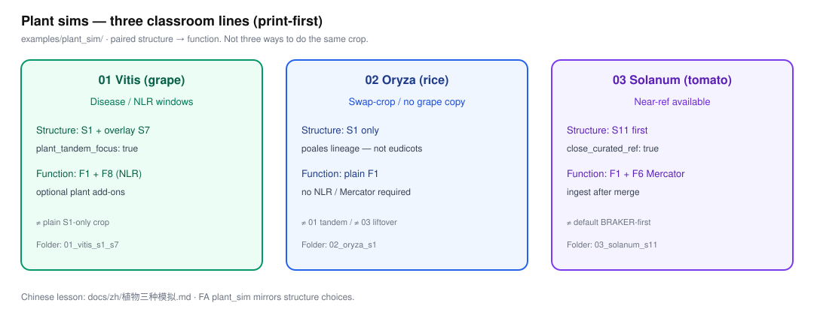

# 三种植物模拟（练习仓库改进）

**01** = 主草稿 S1 + **overlay S7** → F1±F8 · **02** = 纯 S1 → 纯 F1 · **03** = 主草稿 S11（lift+补洞）→ F1+F6（Mercator 加件，merge 后 ingest）。

英文入口与生成好的 plan：[`../../examples/plant_sim/`](../../examples/plant_sim/)。

| 编号 | 物种 | 练什么 |
|------|------|--------|
| 01 | 葡萄 Vitis | **主草稿 S1 + overlay S7**（非第二条主支）；trusted TE；不强制 A4 |
| 02 | 水稻 Oryza | 普通 S1；谱系/EDTA 勿抄葡萄 `--u` |
| 03 | 番茄 Solanum（近缘参考） | 走 **S11** liftover，不是默默 S1 |

功能仓同名目录：葡萄可挂 NLR；水稻纯 F1；番茄可挂 Mercator。只生成 plan / print-first，不下载基因组、不跑 BRAKER/IPS。
